# GuideTuristike

# Enzo Travel – Guide Turistike


> *A sophisticated ASP.NET MVC web application designed to promote and simplify rural tourism in Albania, offering intuitive tools for travelers and administrators alike.*

---

## ✨ Key Features

* 🔐 **Secure user authentication** – intuitive registration and login flow
* 🌍 **Bilingual interface** – Albanian (default) and English switch
* 🌘 **Dark mode / Light mode** – user toggle with elegant theme design
* 🗺️ **Interactive map with Leaflet** – visualize all destinations, calculate distance from **Tirana**
* 💸 **Trip cost estimator** – based on calculated distances
* 🏞️ **35+ curated rural destinations** – tagged by region and type
* 🧾 **Downloadable PDF confirmations** – via Rotativa PDF generation
* 📝 **Reservation form** – with dynamic pricing and email feedback
* 🛠️ **Admin panel** – full-featured management of Locations, Destinations, and Reservations

---

## 💻 Tech Stack

| Layer        | Technology                                       |
| ------------ | ------------------------------------------------ |
| **Frontend** | ASP.NET MVC (Razor Views) · Bootstrap 5 · jQuery |
| **Mapping**  | Leaflet.js · OpenStreetMap                       |
| **Backend**  | ASP.NET MVC 5 (.NET Framework 4.8)               |
| **Database** | SQL Server · Entity Framework 6 (Code First)     |
| **PDF**      | Rotativa (wkhtmltopdf wrapper)                   |
| **DevOps**   | Dockerfile for containerized deployment          |

---

## 🚀 Quick Start

### 1. Clone & Restore

```bash
git clone https://github.com/enzoindabenzo/GuideTuristike.git
cd GuideTuristike
```

Open the solution in **Visual Studio 2022** or JetBrains Rider and let NuGet restore packages automatically.

### 2. Database Setup

* Ensure **SQL Server LocalDB** is running
* Update the `DefaultConnection` in `Web.config` if needed
* Run EF migrations:

```bash
Update-Database
```

### 3. Run the Application

* Press **F5** (IIS Express)
* Go to: `https://localhost:44300/`

### 4. Docker Support (Optional)

```bash
docker build -t guide-turistike .
docker run -p 8080:80 guide-turistike
```

Visit `http://localhost:8080`

---

## 🖼️ Screenshots

1. **Homepage** – animated banner (GIF) and quick navigation
   

2. **User Registration & Login** – secure and responsive forms
   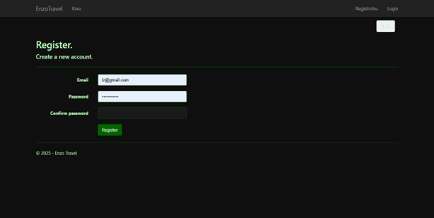
   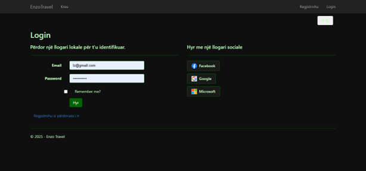

3. **About Us** – overview of purpose and mission
   

4. **Interactive Map with Cost Estimator** – user selects destination, system calculates estimated trip cost
   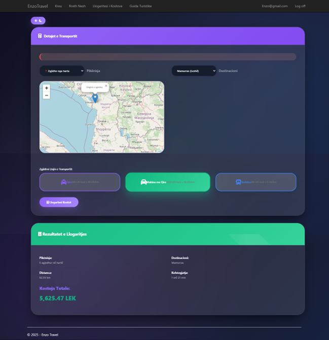

5. **Browse Tourist Destinations** – filtered by category and region
   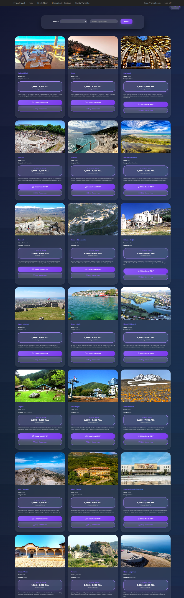

6. **Reservation Form** – complete booking with live cost update
   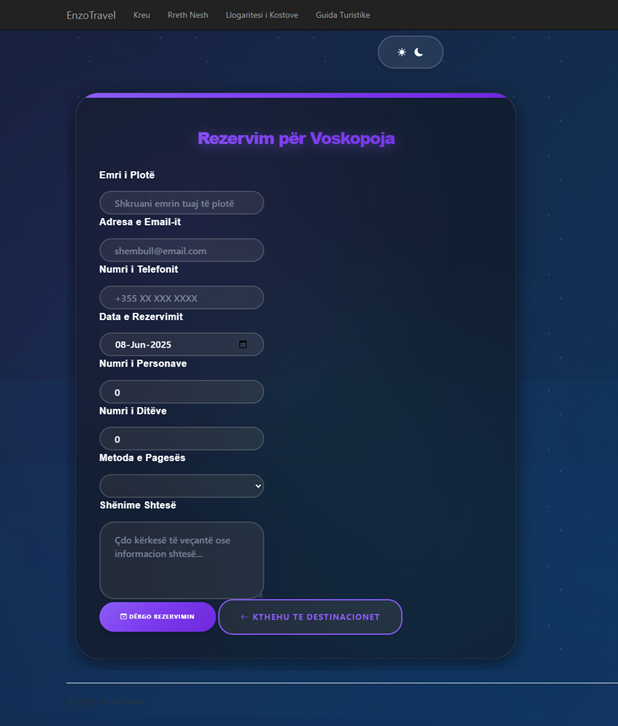

7. **PDF Export** – downloadable summary of reservation
   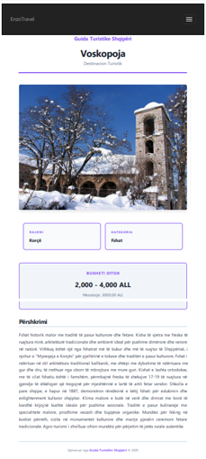

8. **Admin Panel – Location Management**
   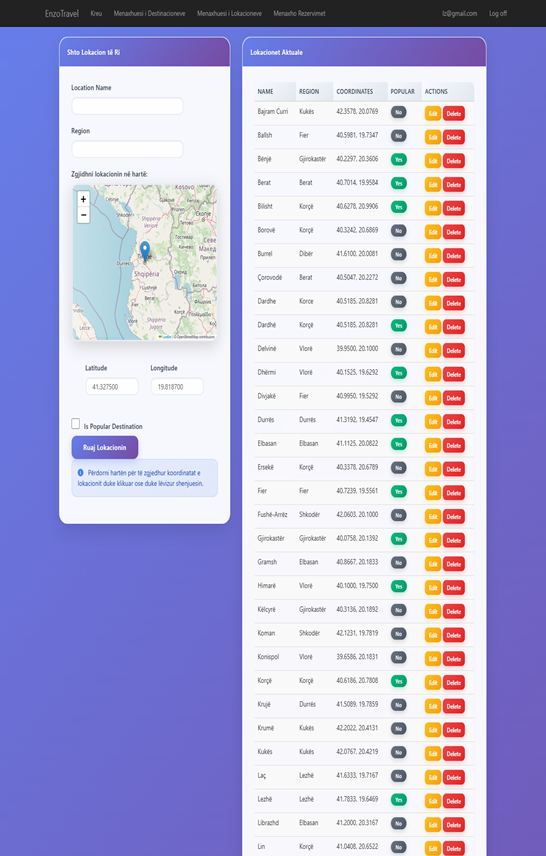
   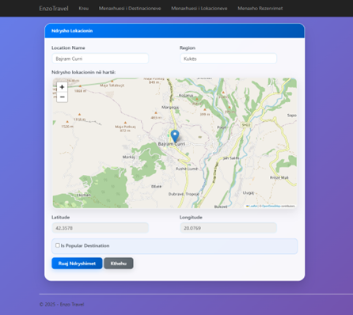
   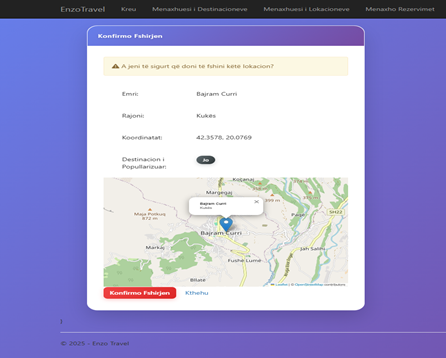

9. **Admin Panel – Destination Management**
   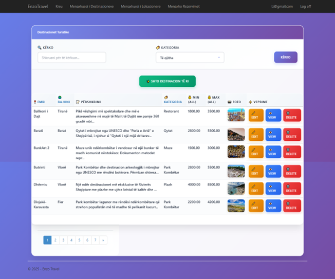
   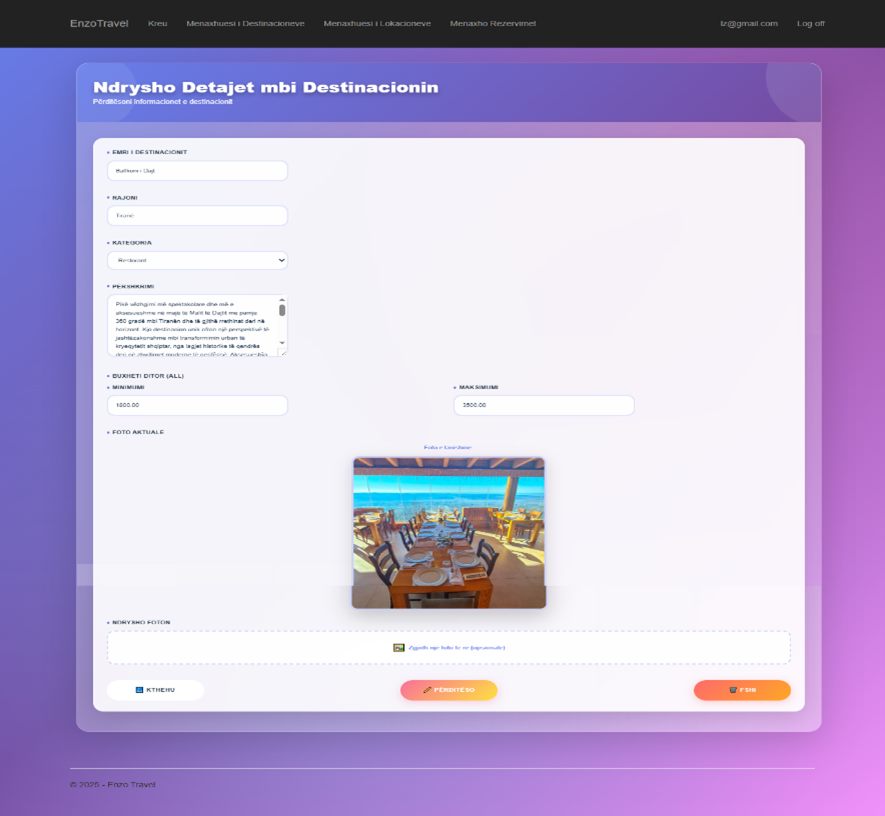
   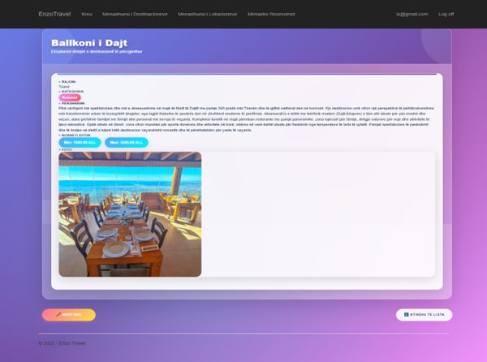
   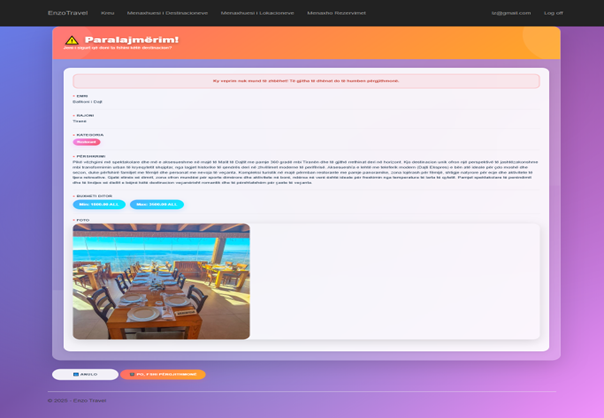

10. **Admin Panel – Reservation Management**
    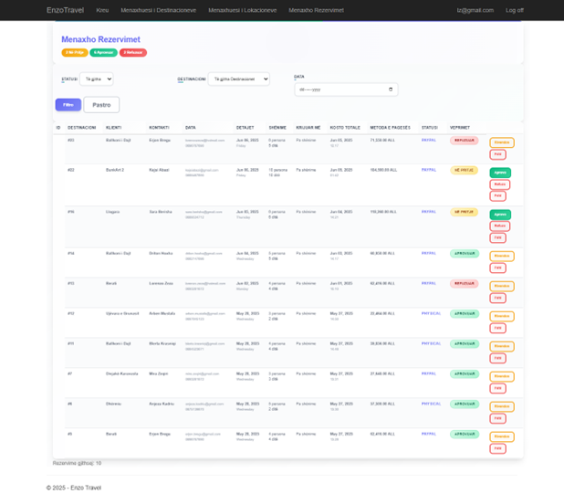

> 📁 Place all visual assets (GIFs, PNGs, JPGs) under `docs/screenshots/` for optimal GitHub rendering.

---

## 🗂️ Project Structure

```
GuideTuristike/
├── Controllers/          # MVC Controllers (user/admin)
├── Models/               # Entity Framework models & ViewModels
├── Views/                # Razor Views
├── Content/              # Static assets (CSS, images)
├── Scripts/              # Client-side JS and map logic
├── Utilities/            # Custom logic (e.g., calculators)
├── Migrations/           # EF code-first migration files
├── Rotativa/             # PDF rendering binaries
└── Dockerfile            # Containerization setup
```

---

## 🤝 Contributing

We welcome contributions from the community:

1. Fork the project
2. Create a new feature branch
3. Commit meaningful changes with proper documentation
4. Push to your GitHub and open a pull request

Please ensure your code is clean, documented, and tested.

---

## 📄 License

This project is open-source and available under the **MIT License**. See the [LICENSE](LICENSE) file for full details.

---

## 🙏 Acknowledgements

* [Leaflet](https://leafletjs.com/) – interactive mapping
* [OpenStreetMap](https://www.openstreetmap.org/) – geographic data
* [Rotativa](https://github.com/webgio/Rotativa) – PDF generation for MVC

---

*Developed with dedication by Enzo Indabenzó and the open-source community.*
